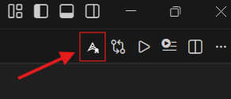
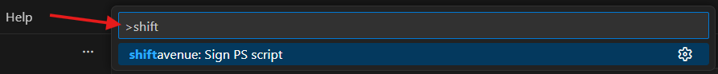
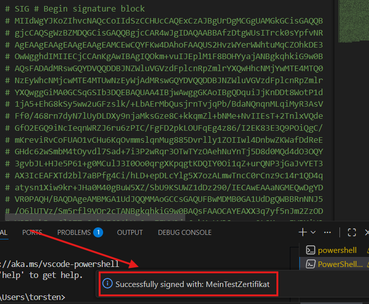

# shiftavenue GmbH PowerShell Script Signer

## Features

Sign PowerShell files that currently open in the vs code editorwindow with a codesigning certificate. The certificate must be installed in the personal certificate store and must be a codesigning certificate.

After installation, this icon appears in the editor toolbar of PowerShell Files.

You can also execute the signing in the command window CTRL + SHIFT + P

After successful signing with the shiftavenue PowerShell Signer, the message appears and the PowerShell script has been signed.

>The PowerShell script is saved automatically.

## Requirements

* Installed PowerShell Extension 
* Installed personal code signing certificate
* Open PowerShell script file (.ps1)

## Extension Settings

This extension contributes the following settings:

* `shiftavenue-ps-signer.certSubjectName`: The 'Subject' name (or part of it) of the installed code signing certificate.
* `shiftavenue-ps-signer.timestampServer`: URL of the timestamp server (so that the signature remains valid even after the certificate expires).

## Known Issues

nn.

## Release Notes

Please use Github-Issues for problems, questions, or requests

### 1.0.0

- Initial release of shiftavenue GmbH PowerShell Script Signer

